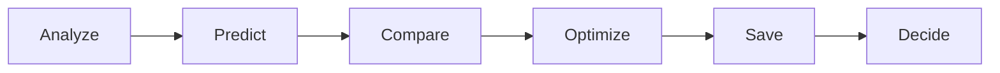
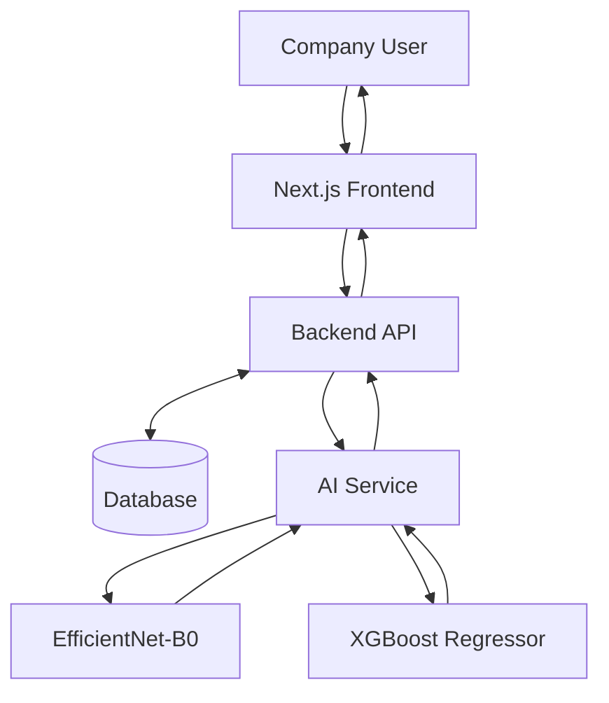
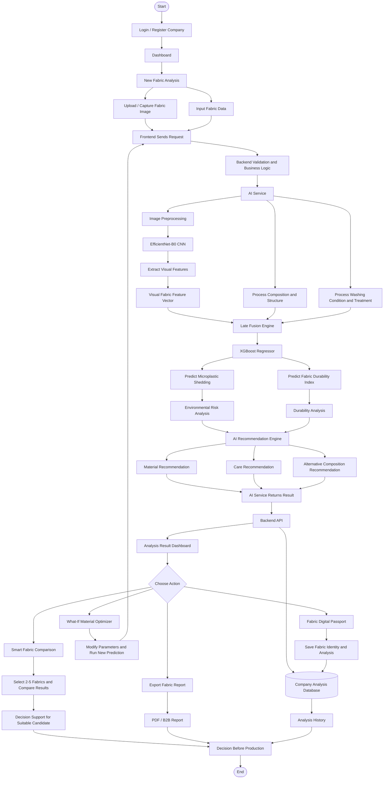
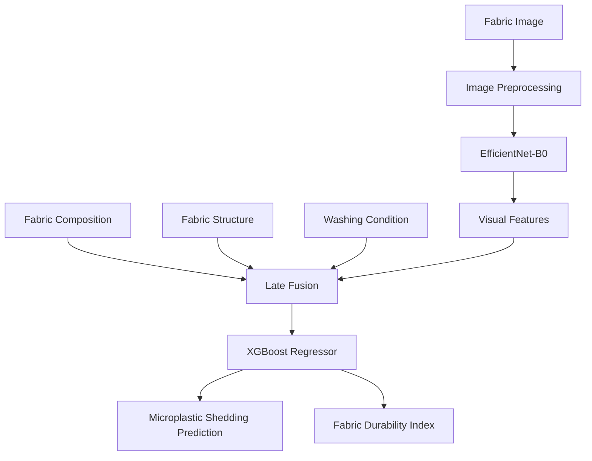
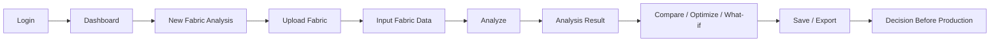

<div align="center">

# FABRIX AI

### Predict. Compare. Optimize.

Platform B2B berbasis AI untuk analisis awal material kain sebelum proses produksi.

[](https://github.com/raykenzienazaru-dot/PNJ)

**Submission for ITECHNO CUP 2026 — Web Development SMA/MA/SMK**

**Tim SATORU**

</div>

---

## Daftar Isi

- [Tim Developer](#tim-developer)
- [Tentang Proyek](#tentang-proyek)
- [SDG Alignment](#sdg-alignment)
- [Fitur Unggulan](#fitur-unggulan)
- [Demo & Screenshot](#demo--screenshot)
- [Teknologi](#teknologi)
- [Arsitektur Sistem](#arsitektur-sistem)
- [Dataset & AI Model](#dataset--ai-model)
- [Instalasi & Setup](#instalasi--setup)
- [Environment Variables](#environment-variables)
- [Penggunaan](#penggunaan)
- [API Documentation](#api-documentation)
- [Testing](#testing)
- [Security & Responsible AI](#security--responsible-ai)
- [Lisensi](#lisensi)

---

## Tim Developer

| Nama | Peran | GitHub |
|---|---|---|
| **Evelly Khanzania Putri** | AI Developer | [Vkzapple](https://github.com/Vkzapple) |
| **Dhiyaa Fazila Nugraha** | Full-Stack Developer | [fzlngh](https://github.com/fzlngh) |
| **Raykenzie Nazaru Fathurrahmansyah** | R&D Assistant | [raykenzienazaru-dot](https://github.com/raykenzienazaru-dot) |

---

## Tentang Proyek

### Latar Belakang

Industri fashion dan tekstil perlu mengevaluasi banyak kandidat material sebelum produksi. Penilaian perlu mempertimbangkan karakteristik visual kain, komposisi serat, perawatan, daya tahan, dan potensi pelepasan mikroplastik secara terstruktur.

FABRIX AI dirancang untuk mendukung alur evaluasi material berikut:



### Solusi yang Ditawarkan

**FABRIX AI** adalah platform B2B *Fabric Intelligence* berbasis Artificial Intelligence. Sistem menggabungkan gambar close-up kain, komposisi serat, serta data *care/treatment* untuk memprediksi **Microplastic Shedding** dan **Fabric Durability Index (FDI)**.

Hasil analisis dapat digunakan untuk membandingkan material, menjalankan simulasi perubahan parameter, memperoleh rekomendasi, menyimpan riwayat, dan menghasilkan laporan.

### Tujuan Proyek

| Aspek | Keterangan |
|---|---|
| **Tujuan Utama** | Mendukung evaluasi dan pemilihan kandidat kain sebelum produksi melalui analisis berbasis AI. |
| **Target Pengguna** | Fashion Brand, Textile Manufacturer, R&D Team, Sustainability Team, dan Procurement Team. |
| **Value Proposition** | *Predict before you produce.* |

### SDG Alignment

FABRIX AI selaras dengan subtema ITECHNO CUP 2026 **“Smart Sustainable Digital Solution for Inclusive Society”** dan mendukung *Sustainable Development Goals* (SDGs) berikut tanpa mengklaim menyelesaikan seluruh targetnya.

#### Primary SDG: SDG 9 — Industry, Innovation and Infrastructure

FABRIX AI mendukung inovasi industri fashion dan tekstil melalui pengembangan platform berbasis web dan Artificial Intelligence. Platform ini membantu proses analisis serta pengambilan keputusan terhadap kandidat material sebelum produksi.

Implementasinya mencakup:

- **Multimodal Fabric Analysis**
- **CNN Fabric Analyzer**
- **Microplastic & Durability Prediction**
- **What-if Material Optimizer**
- **Smart Fabric Comparison**
- **Digital Decision Support** untuk R&D tekstil

#### Supporting SDG: SDG 11 — Sustainable Cities and Communities

FABRIX AI mendukung aspek keberlanjutan melalui analisis potensi *microplastic shedding* dan optimasi kandidat material. Sistem membantu perusahaan mengevaluasi beberapa alternatif kain dan mempertimbangkan material dengan potensi dampak lingkungan yang lebih rendah sebelum proses produksi.

Kontribusi tersebut merupakan bentuk dukungan terhadap SDG 11 dan tidak menyatakan bahwa FABRIX AI secara langsung menyelesaikan seluruh targetnya. Klaim pengurangan mikroplastik secara kuantitatif hanya akan dicantumkan setelah tersedia hasil pengujian aktual.

---

## Fitur Unggulan

Seluruh fitur berikut masih berstatus **direncanakan/dalam pengembangan** karena source code aplikasi belum tersedia di repository.

### Fitur Utama

| Fitur | Deskripsi | Keunggulan |
|---|---|---|
| **Multimodal Fabric Scanner** | Menggabungkan gambar close-up kain dan structured fabric data. | Memanfaatkan data visual dan tabular. |
| **CNN Fabric Analyzer** | EfficientNet-B0 mengekstraksi *visual fabric features* dari gambar kain. | Menyediakan representasi visual tanpa mengklaim pengukuran fisik weave density. |
| **Late-Fusion Prediction Engine** | Menggabungkan visual features, komposisi, struktur, dan washing condition untuk diproses XGBoost Regressor. | Mendukung prediction berbasis multimodal features. |
| **Microplastic Shedding Prediction** | Menghasilkan prediction sesuai target dan unit pada dataset final. | Mendukung screening awal tanpa menetapkan unit yang belum diverifikasi. |
| **Fabric Durability Index** | Menghasilkan prediction atau indikator durability berdasarkan data dan model. | Tidak menetapkan skala, kategori, atau formula sebelum implementasi final. |
| **What-If Material Optimizer** | Menjalankan prediction scenario baru setelah parameter material diubah. | Membandingkan hasil awal dan skenario tanpa mengklaim menemukan global optimum. |
| **Smart Fabric Comparison** | Membandingkan hasil analisis sekitar 2–5 kandidat fabric. | Membantu pengguna menentukan kandidat yang lebih sesuai tanpa pemilihan otomatis. |

### Fitur Tambahan

- **Fabric Digital Passport** *(Dalam Pengembangan)* — identitas digital yang dapat memuat data material dan riwayat analisis yang tersedia.
- **Company Authentication & Dashboard** *(Dalam Pengembangan)* — akses dan ruang kerja perusahaan.
- **Analysis History** *(Dalam Pengembangan)* — penyimpanan riwayat analisis perusahaan.
- **Export Fabric Report** *(Planned Feature)* — pembuatan laporan untuk kebutuhan B2B.

---

## Demo & Screenshot

### Live Demo

**[URL DEMO BELUM TERSEDIA]**

### Screenshot Aplikasi

| Tampilan | Placeholder |
|---|---|
| Dashboard | `assets/dashboard.png` |
| Fabric Analysis | `assets/fabric-analysis.png` |
| Analysis Result | `assets/analysis-result.png` |
| Compare Fabric | `assets/compare-fabric.png` |

### Diagram Flow

<div align="center">


*User journey FABRIX AI.*


*Flow analisis dari input hingga keputusan sebelum produksi.*

</div>

### Video Demo

**[URL VIDEO DEMO BELUM TERSEDIA]**

---

## Teknologi

### Tech Stack

| Area | Teknologi | Status |
|---|---|---|
| **Frontend** | Next.js, TypeScript | Direncanakan |
| **Backend** | Service terpisah dari AI Service | Framework belum ditentukan |
| **AI Service** | Python, EfficientNet-B0/CNN, XGBoost Regressor, Late Fusion | Direncanakan |
| **Database** | Belum ditentukan | Belum tersedia |
| **DevOps & Tools** | Railway atau environment lain untuk AI Service | Konsep deployment |

Backend menjadi lapisan API dan orkestrator. Seluruh preprocessing serta inference machine learning dijalankan oleh **AI Service**, bukan backend utama.

### Alasan Pemilihan Teknologi

| Teknologi | Alasan Pemilihan |
|---|---|
| **Next.js** | Mendukung aplikasi web React dengan routing dan optimasi terintegrasi. |
| **TypeScript** | Membantu konsistensi tipe dan pemeliharaan frontend. |
| **Python** | Menyediakan ekosistem machine learning untuk AI Service. |
| **EfficientNet-B0** | Mengekstraksi fitur visual gambar close-up kain. |
| **XGBoost Regressor** | Melakukan prediksi berdasarkan fitur multimodal. |
| **Late Fusion** | Menggabungkan fitur visual dan data tabular. |

### Dependencies Utama

Belum ada `package.json` atau `requirements.txt` di repository. Dependency akan dicantumkan setelah source code tersedia.

---

## Arsitektur Sistem

### System Architecture



Alur produksi utama adalah **Frontend → Backend → AI Service**. Frontend tidak berkomunikasi langsung dengan AI Service.

#### Tanggung Jawab Backend

Backend direncanakan sebagai bridge/orchestrator untuk validation, business logic, data perusahaan dan kain, akses database, analysis history, Fabric Digital Passport, serta pertukaran request dan response dengan AI Service. Backend tidak menjalankan model training, EfficientNet/CNN inference, visual feature extraction, atau XGBoost inference.

#### Tanggung Jawab AI Service

AI Service direncanakan menangani image preprocessing, visual feature extraction, late fusion, XGBoost inference, prediction, dan pemrosesan rekomendasi. Implementasi aktual akan didokumentasikan setelah source code tersedia.

### User Flow



### AI Pipeline



### Database Schema

**[DATABASE SCHEMA BELUM FINAL]**

Database belum tersedia sehingga skema aktual belum dapat didokumentasikan.

### Folder Structure

```text
PNJ/
├── .vscode/
│   └── extensions.json
├── FLOWW.drawio.png
├── USER.drawio.png
└── README.MD
```

---

## Dataset & AI Model

### Dataset

Dataset belum tersedia di repository. Informasi dataset akan diperbarui setelah dataset final dan pipeline preprocessing ditetapkan. Dokumentasi berikut belum dapat diverifikasi:

- nama dan sumber dataset;
- jumlah sampel;
- fitur serta target variables;
- unit target microplastic shedding;
- missing values dan preprocessing;
- pembagian train, validation, dan test.

### Preprocessing

Pipeline preprocessing aktual belum tersedia. Secara konseptual, gambar akan diproses sebelum visual feature extraction, sedangkan data komposisi, struktur, dan washing condition disiapkan sebagai structured fabric data untuk late fusion.

### Model Architecture

Arsitektur yang direncanakan menggunakan **EfficientNet-B0** untuk visual feature extraction dan **XGBoost Regressor** untuk prediction setelah late fusion. CNN tidak dinyatakan secara langsung menentukan microplastic shedding.

### Model Evaluation

*Model evaluation will be updated after testing on the final dataset.*

| Model | MAE | RMSE | R² |
|---|---:|---:|---:|
| Tabular Only | Belum diuji | Belum diuji | Belum diuji |
| Visual Only | Belum diuji | Belum diuji | Belum diuji |
| Multimodal Late Fusion | Belum diuji | Belum diuji | Belum diuji |

### Model Limitations

- Akurasi, confidence, unit target, dan kemampuan generalisasi belum dapat dinyatakan sebelum dataset serta hasil evaluasi tersedia.
- FDI belum memiliki skala, kategori, formula, atau interpretasi umur pakai yang terverifikasi.
- Hasil prediction bergantung pada kualitas dan representasi dataset final.
- Output model digunakan sebagai decision support, bukan hasil pengujian laboratorium.

---

## Instalasi & Setup

Repository saat ini hanya berisi dokumentasi dan aset diagram. Source code frontend, backend, serta AI Service belum tersedia.

### Prerequisites

- Git
- Runtime dan tool lain: **[BELUM DITENTUKAN]**

### Clone Repository

```bash
git clone https://github.com/raykenzienazaru-dot/PNJ.git
cd PNJ
```

### Frontend

**[SETUP FRONTEND BELUM TERSEDIA]**

### Backend

**[SETUP BACKEND BELUM TERSEDIA]**

### AI Service

**[SETUP AI SERVICE BELUM TERSEDIA]**

---

## Environment Variables

Environment variable aktual belum dapat ditentukan karena source code belum tersedia. Nama berikut hanya menunjukkan kebutuhan konfigurasi konseptual dan harus disesuaikan dengan implementasi:

```env
NEXT_PUBLIC_API_URL="your_value_here"
AI_SERVICE_URL="your_value_here"
DATABASE_URL="your_value_here"
```

Jangan menyimpan API key, password, token, atau secret asli di repository.

---

## Penggunaan



---

## API Documentation

Source code backend dan AI Service belum tersedia. Oleh karena itu, belum ada endpoint aktual yang dapat didokumentasikan.

### Frontend → Backend API

**[ENDPOINT BELUM TERSEDIA]**

### Backend → AI Service

**[ENDPOINT BELUM TERSEDIA]**

Endpoint akan didokumentasikan hanya setelah implementasinya tersedia.

---

## Testing

Belum terdapat source code, konfigurasi testing, atau hasil pengujian.

Hasil evaluasi model dicatat pada bagian [Dataset & AI Model](#dataset--ai-model) setelah eksperimen aktual tersedia.

### Software Test Coverage

```text
Statements : [BELUM DIUJI]
Branches   : [BELUM DIUJI]
Functions  : [BELUM DIUJI]
Lines      : [BELUM DIUJI]
```

---

## Security & Responsible AI

Implementasi keamanan belum dapat diverifikasi karena source code aplikasi belum tersedia. Aspek berikut akan didokumentasikan berdasarkan implementasi aktual:

- input dan file upload validation;
- authentication dan authorization perusahaan;
- password handling;
- API security dan perlindungan data pengguna/perusahaan;
- penggunaan environment variables untuk konfigurasi sensitif.

Prediction harus disajikan secara transparan bersama keterbatasan model dan dataset. FABRIX AI diposisikan sebagai **AI-assisted decision support**, bukan penentu keputusan otomatis.

> **Disclaimer:** Hasil prediksi FABRIX AI merupakan sistem pendukung keputusan dan tidak menggantikan pengujian laboratorium material.

---

## Lisensi

**[LICENSE BELUM DITENTUKAN]**

Repository belum memiliki file lisensi.

---

<div align="center">

**Predict. Compare. Optimize.**

**Made with by SATORU for ITECHNO CUP 2026**

</div>
