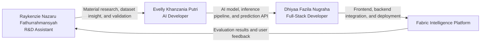
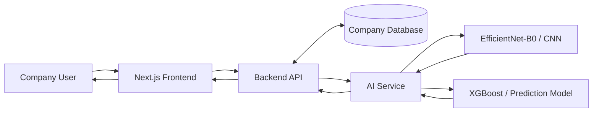
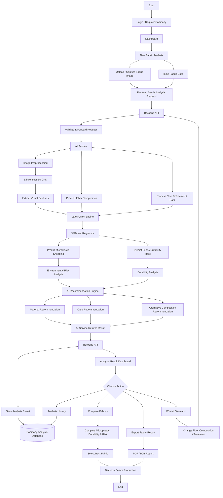
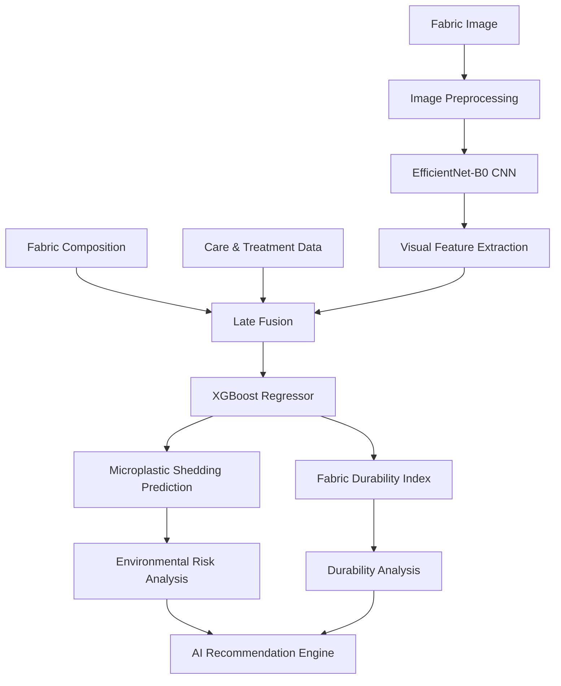

+<div align="center">

# [NAMA PROYEK]

### AI-Powered Fabric Intelligence for Smarter and More Sustainable Material Decisions

[](https://[URL_DEMO])

[](https://[URL_REPO])

[](LICENSE)

**Submission for ITECHNO CUP 2026 - Web Development**

**By SATORU**

</div>

---

## 📋 Daftar Isi

- [Tim Developer](#-tim-developer)
- [Tentang Proyek](#-tentang-proyek)
- [Fitur Unggulan](#-fitur-unggulan)
- [Demo & Screenshot](#-demo--screenshot)
- [Teknologi](#️-teknologi)
- [Arsitektur Sistem](#️-arsitektur-sistem)
- [Instalasi & Setup](#️-instalasi--setup)
- [Penggunaan](#-penggunaan)
- [API Documentation](#-api-documentation)
- [Testing](#-testing)
- [Lisensi](#-lisensi)

---

## 👥 Tim Developer

| Nama | Peran | GitHub |
|---|---|---|
| **Evelly Khanzania Putri** | AI Developer | [GitHub](https://github.com/[username-evelly]) |
| **Dhiyaa Fazila Nugraha** | Full-Stack Developer | [GitHub](https://github.com/[username-dhiyaa]) |
| **Raykenzie Nazaru Fathurrahmansyah** | R&D Assistant | [GitHub](https://github.com/[username-raykenzie]) |

### Team Responsibility Flow



---

## 🎯 Tentang Proyek

### Latar Belakang

Industri fashion dan tekstil membutuhkan proses pemilihan material yang tidak hanya mempertimbangkan karakteristik kain, tetapi juga daya tahan serta potensi dampak lingkungan dari material yang digunakan. Pada tahap R&D, perusahaan dapat memiliki banyak kandidat kain dengan komposisi dan perlakuan yang berbeda sehingga proses evaluasi material membutuhkan data yang terstruktur dan dapat dibandingkan.

**[NAMA PROYEK]** dikembangkan sebagai platform **B2B Fabric Intelligence berbasis AI** untuk membantu perusahaan fashion dan tekstil melakukan analisis awal terhadap kandidat kain sebelum proses produksi. Sistem menggabungkan data visual kain dengan data komposisi serta care/treatment untuk menghasilkan prediksi yang dapat digunakan sebagai pendukung pengambilan keputusan.

### Solusi yang Ditawarkan

Pengguna perusahaan dapat mengunggah atau mengambil gambar close-up kain, memasukkan data komposisi serat dan parameter perawatan, kemudian menjalankan analisis melalui satu dashboard.

Sistem menghasilkan:

- **Microplastic Shedding Prediction**
- **Fabric Durability Index (FDI)**
- **Environmental Risk Analysis**
- **Durability Analysis**
- **Material Recommendation**
- **Care Recommendation**
- **Alternative Composition Recommendation**

Hasil tersebut selanjutnya dapat digunakan untuk membandingkan kandidat kain, menjalankan skenario *what-if*, menyimpan riwayat analisis, dan menghasilkan laporan untuk kebutuhan B2B.

> **Value Proposition:** *Predict before you produce.*

### Tujuan Proyek

- 🎯 **Tujuan Utama**: Membantu proses evaluasi dan pemilihan kandidat kain sebelum produksi melalui analisis berbasis AI.
- 📊 **Target Pengguna**: Fashion Brand, Textile Manufacturer, R&D Team, Sustainability Team, dan Procurement Team.
- 💡 **Value Proposition**: Menggabungkan analisis visual dan data material dalam satu platform untuk mendukung keputusan material yang lebih terukur.

---

## ✨ Fitur Unggulan

### Fitur Utama

| Fitur | Deskripsi | Keunggulan |
|---|---|---|
| **Multimodal Fabric Analysis** | Menggabungkan gambar kain dengan data komposisi dan care/treatment. | Analisis tidak hanya bergantung pada satu jenis input. |
| **Microplastic Shedding Prediction** | Menghasilkan estimasi potensi pelepasan mikroplastik berdasarkan model yang digunakan. | Membantu screening awal kandidat material. |
| **Fabric Durability Index** | Menghasilkan indeks prediksi daya tahan kain. | Membantu perusahaan mempertimbangkan durability sebelum produksi. |
| **AI Material Optimizer** | Memberikan rekomendasi alternatif material/parameter berdasarkan hasil analisis. | Mengubah hasil prediksi menjadi rekomendasi yang dapat ditindaklanjuti. |
| **Compare Fabrics** | Membandingkan hasil microplastic, durability, dan risk beberapa kandidat kain. | Mempermudah pemilihan kandidat material. |
| **What-if Simulator** | Pengguna dapat mengubah komposisi atau treatment dan menjalankan analisis ulang. | Mendukung eksplorasi berbagai skenario material. |

### Fitur Tambahan

- **Fabric Digital Passport** — menyimpan identitas dan hasil analisis material secara terstruktur.
- **Analysis History** — menyimpan riwayat analisis perusahaan.
- **Environmental Risk Analysis** — menyajikan interpretasi risiko berdasarkan hasil prediksi.
- **AI Recommendation** — memberikan rekomendasi material, care, dan alternatif komposisi.
- **Export Fabric Report** — menghasilkan PDF/B2B report dari hasil analisis.

---

## 📸 Demo & Screenshot

### Live Demo

🔗 **[Kunjungi Website](https://[URL_DEMO])**

### Screenshot Aplikasi

<div align="center">


<p><em>Dashboard - Panel utama perusahaan untuk mengelola analisis kain.</em></p>


<p><em>New Fabric Analysis - Upload gambar dan input data kain.</em></p>


<p><em>Analysis Result - Hasil prediksi, analisis risiko, dan rekomendasi.</em></p>

</div>

### Video Demo

📹 **[Link Video Demo](https://[URL_VIDEO])** _(opsional)_

---

## 🛠️ Teknologi

### Tech Stack

#### Frontend

```text
Framework     : Next.js
Language      : TypeScript
UI Library    : [ISI SESUAI REPOSITORY]
State Mgmt    : [ISI SESUAI REPOSITORY]
Validation    : [ISI SESUAI REPOSITORY]
```

#### Backend

```text
Runtime       : [BELUM DITENTUKAN / SESUAI REPOSITORY]
Framework     : [BELUM DITENTUKAN / SESUAI REPOSITORY]
Database      : [BELUM DITENTUKAN / SESUAI REPOSITORY]
ORM           : [BELUM DITENTUKAN / SESUAI REPOSITORY]
Auth          : [BELUM DITENTUKAN / SESUAI REPOSITORY]
```

> Backend berfungsi sebagai **orchestrator/API layer** antara frontend, database, dan AI Service. Proses machine-learning inference tidak dijalankan pada backend utama.

#### AI Service

```text
Language      : Python
CNN           : EfficientNet-B0
ML Model      : XGBoost Regressor
Architecture  : Multimodal Late Fusion
API Framework : [BELUM DITENTUKAN]
```

#### DevOps & Tools

```text
Frontend Deployment  : [Vercel / SESUAI IMPLEMENTASI]
Backend Deployment   : [Railway / SESUAI IMPLEMENTASI]
AI Deployment        : Development lokal → [Railway / Edge / SESUAI IMPLEMENTASI]
CI/CD                : [BELUM DITENTUKAN]
Testing              : [BELUM DITENTUKAN]
Monitoring           : [BELUM DITENTUKAN]
```

### Alasan Pemilihan Teknologi

| Teknologi | Alasan Pemilihan |
|---|---|
| **Next.js** | Mendukung pengembangan aplikasi web modern berbasis React dengan routing dan optimasi yang terintegrasi. |
| **TypeScript** | Membantu menjaga konsistensi tipe data dan maintainability pada frontend. |
| **Python** | Mendukung ekosistem machine learning yang digunakan oleh AI Service. |
| **EfficientNet-B0** | Digunakan untuk mengekstraksi fitur visual dari gambar close-up kain. |
| **XGBoost** | Digunakan pada tahap prediksi setelah penggabungan fitur multimodal. |
| **Late Fusion** | Menggabungkan representasi visual dengan data tabular sebelum proses prediksi. |

### Dependencies Utama

Dependencies harus disesuaikan dengan implementasi repository aktual.

```json
{
  "frontend": {
    "next": "[VERSION]",
    "typescript": "[VERSION]"
  },
  "backend": {
    "[PACKAGE]": "[VERSION]"
  },
  "ai-service": {
    "[PACKAGE]": "[VERSION]"
  }
}
```

---

## 🏗️ Arsitektur Sistem

### System Architecture

Arsitektur memisahkan **Frontend**, **Backend API**, dan **AI Service**. Frontend tidak menjalankan proses prediksi secara langsung. Backend menerima request aplikasi dan menjadi penghubung menuju AI Service serta database.



### End-to-End System Flow



### AI Pipeline

AI Pipeline dipisahkan dari user flow karena seluruh inference dilakukan oleh **AI Service**.



### Alur Komunikasi Service

```text
User
  ↓
Next.js Frontend
  ↓
Backend API
  ├──────────────↔ Database
  ↓
AI Service
  ↓
AI Models
  ↓
AI Service
  ↓
Backend API
  ↓
Frontend
  ↓
User
```

Backend **tidak melakukan prediksi**. Seluruh preprocessing dan inference machine learning berada pada AI Service.

### Database Schema

> ERD akan disesuaikan setelah database final ditentukan.

Entitas minimum yang diperkirakan diperlukan berdasarkan flow aplikasi:

```text
Company/User
    │
    └── Fabric Analysis
            │
            ├── Fabric Data
            ├── Prediction Result
            └── Analysis History
```

### Folder Structure

Struktur final harus mengikuti repository. Pemisahan service yang direkomendasikan:

```text
project-root/
├── frontend/                 # Next.js application
│   ├── src/
│   ├── public/
│   └── ...
│
├── backend/                  # Main Backend API
│   ├── src/
│   └── ...
│
├── ai-service/               # Machine Learning Service
│   ├── models/
│   ├── preprocessing/
│   ├── services/
│   └── ...
│
└── docs/
```

---

## ⚙️ Instalasi & Setup

### Prerequisites

Pastikan telah menginstall:

- **Node.js** — versi mengikuti kebutuhan repository.
- **npm / yarn / pnpm**
- **Python** — versi mengikuti AI Service.
- **Git**
- **[Database]** — setelah teknologi database ditentukan.

### 1️⃣ Clone Repository

```bash
git clone https://github.com/[username]/[repo-name].git
cd [repo-name]
```

### 2️⃣ Frontend Setup

```bash
cd frontend
npm install
npm run dev
```

Frontend development:

```text
http://localhost:3000
```

### 3️⃣ Backend Setup

```bash
cd backend
npm install
npm run dev
```

> Perintah backend disesuaikan kembali setelah framework backend final tersedia.

### 4️⃣ AI Service Setup

```bash
cd ai-service

python -m venv .venv
```

Aktifkan virtual environment sesuai sistem operasi, kemudian:

```bash
pip install -r requirements.txt
```

Jalankan AI Service menggunakan perintah sesuai framework API yang dipilih.

### 5️⃣ Environment Variables

Buat `.env` berdasarkan `.env.example`.

Contoh:

```env
# Frontend
NEXT_PUBLIC_BACKEND_URL="http://localhost:[BACKEND_PORT]"

# Backend
PORT="[BACKEND_PORT]"
DATABASE_URL="[DATABASE_CONNECTION_STRING]"
AI_SERVICE_URL="http://localhost:[AI_SERVICE_PORT]"

# Authentication
AUTH_SECRET="[SECRET]"
```

> Jangan commit credential, API key, token, password, atau secret asli ke repository.

### Development Communication

```text
Frontend (localhost:3000)
        ↓
Backend (localhost:[PORT])
        ↓
AI Service (localhost:[PORT])
```

Saat deployment, URL service dapat diganti melalui environment variable tanpa mengubah flow aplikasi.

---

## 🚀 Penggunaan

### User Guide

1. **Registrasi/Login Company** — pengguna masuk ke akun perusahaan.
2. **Dashboard** — pengguna melihat akses menuju analisis dan riwayat.
3. **New Fabric Analysis** — membuat analisis kain baru.
4. **Upload / Capture Fabric Image** — memasukkan gambar close-up kain.
5. **Input Fabric Data** — memasukkan komposisi serat dan data care/treatment.
6. **Analyze** — frontend mengirim data ke backend untuk diteruskan ke AI Service.
7. **Analysis Result** — pengguna melihat Microplastic Prediction, FDI, risk analysis, dan rekomendasi.
8. **Choose Action** — pengguna dapat melakukan Compare Fabrics, What-if Simulation, Export Report, atau membuka Analysis History.
9. **Decision Before Production** — hasil digunakan sebagai pendukung pemilihan kandidat material.

### What-if Simulator

Pengguna dapat mengubah parameter seperti komposisi atau treatment.

```text
Current Fabric
      ↓
Change Composition / Treatment
      ↓
Backend API
      ↓
AI Service
      ↓
New Prediction
      ↓
Compare Scenario
```

---

## 📚 API Documentation

### Base URL

```text
Development Backend:
http://localhost:[BACKEND_PORT]/api

Development AI Service:
http://localhost:[AI_SERVICE_PORT]

Production:
[ISI SETELAH DEPLOYMENT]
```

### Backend API

Endpoint berikut harus disesuaikan dengan source code setelah implementasi tersedia.

```http
# Authentication
POST /api/auth/register
POST /api/auth/login
POST /api/auth/logout
GET  /api/auth/me

# Fabric Analysis
POST /api/analysis
GET  /api/analysis
GET  /api/analysis/:id

# Comparison / Simulation
POST /api/analysis/compare
POST /api/analysis/simulate

# Reports
GET /api/analysis/:id/report
```

> Daftar di atas merupakan rancangan endpoint berdasarkan flow sistem, bukan dokumentasi endpoint final. README harus diperbarui mengikuti implementasi aktual.

### Backend → AI Service

Kontrak endpoint AI Service akan didokumentasikan setelah implementasi API final.

Flow:

```text
Frontend
   ↓
POST analysis request
   ↓
Backend
   ↓
AI Service
   ↓
Prediction result
   ↓
Backend
   ↓
Frontend
```

---

## 🧪 Testing

### Testing Plan

Pengujian direncanakan mencakup:

- Unit testing
- Backend API testing
- AI Service API testing
- Frontend ↔ Backend integration testing
- Backend ↔ AI Service integration testing
- End-to-End user flow testing
- Model evaluation

### Model Evaluation

Untuk output regression, evaluasi model dapat mencakup:

```text
MAE  : [BELUM DIISI]
RMSE : [BELUM DIISI]
R²   : [BELUM DIISI]
```

Nilai metric hanya akan dicantumkan setelah proses evaluasi terhadap dataset final dilakukan.

### Test Coverage

```text
Statements : [BELUM DIUJI]
Branches   : [BELUM DIUJI]
Functions  : [BELUM DIUJI]
Lines      : [BELUM DIUJI]
```

> Testing dan coverage akan diperbarui setelah proses pengujian selesai. Tidak ada nilai coverage yang diasumsikan.

---

## 📄 Lisensi

Proyek ini dilisensikan di bawah **MIT License** — lihat file [LICENSE](LICENSE) untuk detail lebih lanjut.

---

<div align="center">

**Predict. Compare. Optimize. Decide.**

**Made with ❤️ by SATORU for ITECHNO CUP 2026**

</div>
