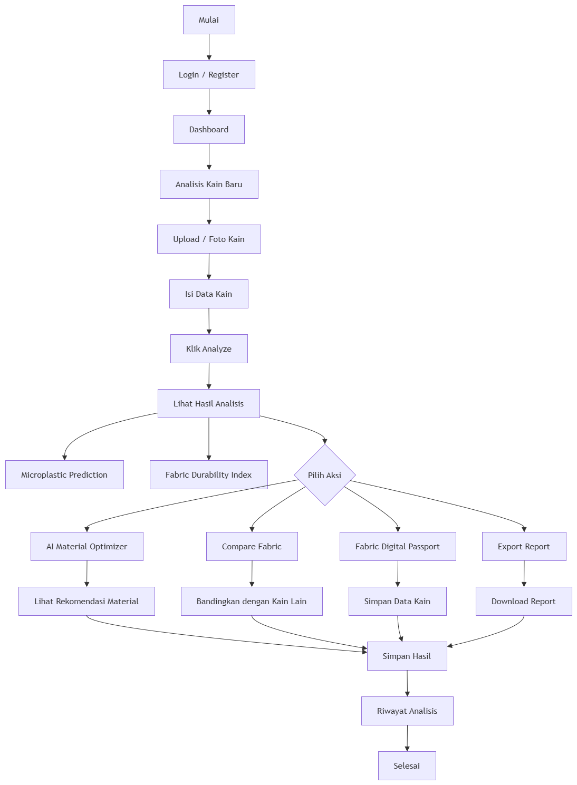
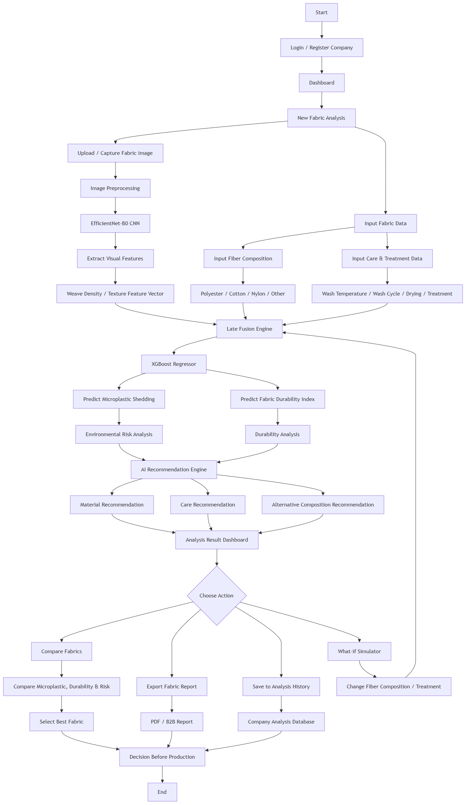
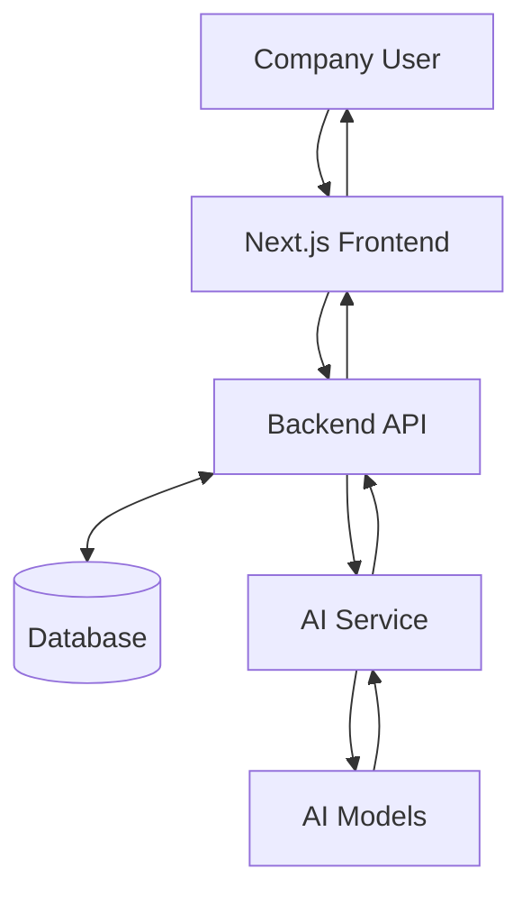
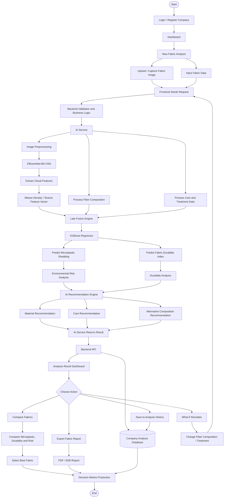
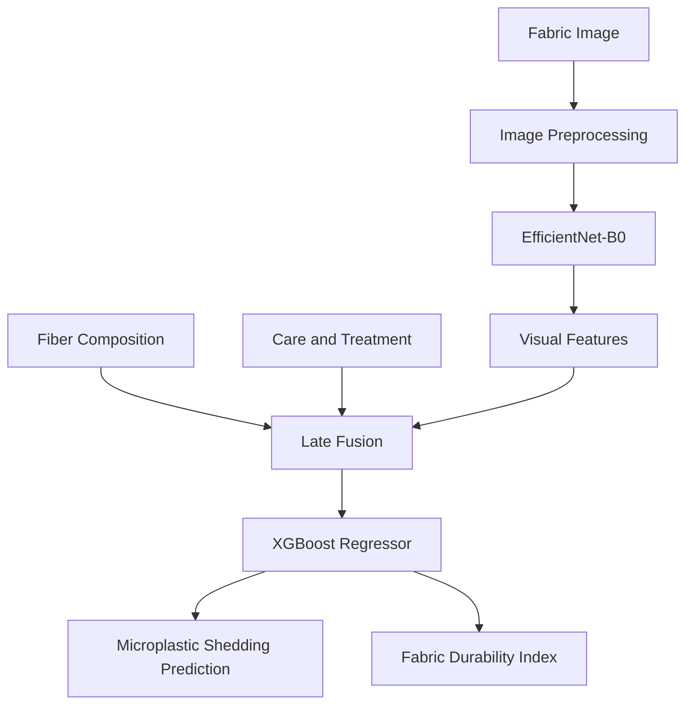
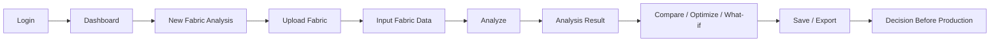

<div align="center">

# FABRIX AI

### Predict. Compare. Optimize.

Platform B2B berbasis AI untuk analisis awal material kain sebelum proses produksi.

[](#demo--screenshot)
[](https://github.com/raykenzienazaru-dot/PNJ)
[](#lisensi)

**Submission for ITECHNO CUP 2026 — Web Development**

**Tim SATORU**

</div>

---

## Daftar Isi

- [Tim Developer](#tim-developer)
- [Tentang Proyek](#tentang-proyek)
- [Fitur Unggulan](#fitur-unggulan)
- [Demo & Screenshot](#demo--screenshot)
- [Teknologi](#teknologi)
- [Arsitektur Sistem](#arsitektur-sistem)
- [Instalasi & Setup](#instalasi--setup)
- [Environment Variables](#environment-variables)
- [Penggunaan](#penggunaan)
- [API Documentation](#api-documentation)
- [Testing](#testing)
- [Lisensi](#lisensi)

---

## Tim Developer

| Nama | Peran | GitHub |
|---|---|---|
| **Evelly Khanzania Putri** | AI Developer | Belum dicantumkan |
| **Dhiyaa Fazila Nugraha** | Full-Stack Developer | Belum dicantumkan |
| **Raykenzie Nazaru Fathurrahmansyah** | R&D Assistant | [raykenzienazaru-dot](https://github.com/raykenzienazaru-dot) |

---

## Tentang Proyek

### Latar Belakang

Industri fashion dan tekstil perlu mengevaluasi banyak kandidat material sebelum produksi. Penilaian perlu mempertimbangkan karakteristik visual kain, komposisi serat, perawatan, daya tahan, dan potensi pelepasan mikroplastik secara terstruktur.

### Solusi yang Ditawarkan

**FABRIX AI** adalah platform B2B *Fabric Intelligence* berbasis Artificial Intelligence. Sistem menggabungkan gambar close-up kain, komposisi serat, serta data *care/treatment* untuk memprediksi **Microplastic Shedding** dan **Fabric Durability Index (FDI)**.

Hasil analisis dapat digunakan untuk membandingkan material, menjalankan simulasi perubahan parameter, memperoleh rekomendasi, menyimpan riwayat, dan menghasilkan laporan.

### Tujuan Proyek

| Aspek | Keterangan |
|---|---|
| **Tujuan Utama** | Mendukung evaluasi dan pemilihan kandidat kain sebelum produksi melalui analisis berbasis AI. |
| **Target Pengguna** | Fashion Brand, Textile Manufacturer, R&D Team, Sustainability Team, dan Procurement Team. |
| **Value Proposition** | *Predict before you produce.* |

---

## Fitur Unggulan

### Fitur Utama

| Fitur | Deskripsi | Keunggulan |
|---|---|---|
| **Multimodal Fabric Analysis** | Menggabungkan gambar kain, komposisi serat, serta data perawatan. | Memanfaatkan data visual dan tabular. |
| **Microplastic Shedding Prediction** | Memprediksi potensi pelepasan mikroplastik. | Mendukung penyaringan awal material. |
| **Fabric Durability Index** | Memprediksi indeks daya tahan material. | Membantu evaluasi ketahanan kain. |
| **AI Material Optimizer** | Memberikan rekomendasi alternatif material atau parameter. | Menghasilkan rekomendasi yang dapat ditindaklanjuti. |
| **Compare Fabrics** | Membandingkan mikroplastik, daya tahan, dan risiko beberapa kain. | Mempermudah pemilihan kandidat. |
| **What-if Simulator** | Menjalankan analisis ulang setelah komposisi atau perlakuan diubah. | Mendukung eksplorasi skenario. |

### Fitur Tambahan

- **Fabric Digital Passport** — menyimpan informasi dan hasil analisis material.
- **Analysis History** — menyimpan riwayat analisis perusahaan.
- **Export Fabric Report** — menghasilkan laporan untuk kebutuhan B2B.

---

## Demo & Screenshot

### Live Demo

**[URL DEMO BELUM TERSEDIA]**

### Screenshot Aplikasi

| Tampilan | Placeholder |
|---|---|
| Dashboard | `assets/dashboard.png` |
| Fabric Analysis | `assets/fabric-analysis.png` |
| Analysis Result | `assets/analysis-result.png` |
| Compare Fabric | `assets/compare-fabric.png` |

### Diagram Flow

<div align="center">



*User journey FABRIX AI.*



*Flow analisis dari input hingga keputusan sebelum produksi.*

</div>

### Video Demo

**[URL VIDEO DEMO BELUM TERSEDIA]**

---

## Teknologi

### Tech Stack

| Area | Teknologi | Status |
|---|---|---|
| **Frontend** | Next.js, TypeScript | Direncanakan |
| **Backend** | Service terpisah dari AI Service | Framework belum ditentukan |
| **AI Service** | Python, EfficientNet-B0/CNN, XGBoost Regressor, Late Fusion | Direncanakan |
| **Database** | Belum ditentukan | Belum tersedia |
| **DevOps & Tools** | Railway atau environment lain untuk AI Service | Konsep deployment |

Backend menjadi lapisan API dan orkestrator. Seluruh preprocessing serta inference machine learning dijalankan oleh **AI Service**, bukan backend utama.

### Alasan Pemilihan Teknologi

| Teknologi | Alasan Pemilihan |
|---|---|
| **Next.js** | Mendukung aplikasi web React dengan routing dan optimasi terintegrasi. |
| **TypeScript** | Membantu konsistensi tipe dan pemeliharaan frontend. |
| **Python** | Menyediakan ekosistem machine learning untuk AI Service. |
| **EfficientNet-B0** | Mengekstraksi fitur visual gambar close-up kain. |
| **XGBoost Regressor** | Melakukan prediksi berdasarkan fitur multimodal. |
| **Late Fusion** | Menggabungkan fitur visual dan data tabular. |

### Dependencies Utama

Belum ada `package.json` atau `requirements.txt` di repository. Dependency akan dicantumkan setelah source code tersedia.

---

## Arsitektur Sistem

### 1. System Architecture



Alur produksi utama adalah **Frontend → Backend → AI Service**. Frontend tidak berkomunikasi langsung dengan AI Service.

### 2. End-to-End System Flow



### 3. AI Pipeline



### Database Schema

**[DATABASE SCHEMA BELUM FINAL]**

Database belum tersedia sehingga skema aktual belum dapat didokumentasikan.

### Folder Structure

```text
PNJ/
├── .vscode/
│   └── extensions.json
├── FLOWW.drawio.png
├── USER.drawio.png
└── README.MD
```

---

## Instalasi & Setup

Repository saat ini hanya berisi dokumentasi dan aset diagram. Source code frontend, backend, serta AI Service belum tersedia.

### Prerequisites

- Git
- Runtime dan tool lain: **[BELUM DITENTUKAN]**

### Clone Repository

```bash
git clone https://github.com/raykenzienazaru-dot/PNJ.git
cd PNJ
```

### Frontend

**[SETUP FRONTEND BELUM TERSEDIA]**

### Backend

**[SETUP BACKEND BELUM TERSEDIA]**

### AI Service

**[SETUP AI SERVICE BELUM TERSEDIA]**

---

## Environment Variables

Environment variable aktual belum dapat ditentukan karena source code belum tersedia.

```env
VARIABLE_NAME="your_value_here"
```

Jangan menyimpan API key, password, token, atau secret asli di repository.

---

## Penggunaan



---

## API Documentation

Source code backend dan AI Service belum tersedia. Oleh karena itu, belum ada endpoint aktual yang dapat didokumentasikan.

### Frontend → Backend API

**[ENDPOINT BELUM TERSEDIA]**

### Backend → AI Service

**[ENDPOINT BELUM TERSEDIA]**

Endpoint akan didokumentasikan hanya setelah implementasinya tersedia.

---

## Testing

Belum terdapat source code, konfigurasi testing, atau hasil pengujian.

### Model Evaluation

*Model evaluation will be updated after testing on the final dataset.*

| Metric | Nilai |
|---|---|
| MAE | Belum diuji |
| RMSE | Belum diuji |
| R² | Belum diuji |

### Software Test Coverage

```text
Statements : [BELUM DIUJI]
Branches   : [BELUM DIUJI]
Functions  : [BELUM DIUJI]
Lines      : [BELUM DIUJI]
```

---

## Lisensi

**[LICENSE BELUM DITENTUKAN]**

Repository belum memiliki file lisensi.

---

<div align="center">

**Predict. Compare. Optimize.**

**Made with ❤️ by SATORU for ITECHNO CUP 2026**

</div>
