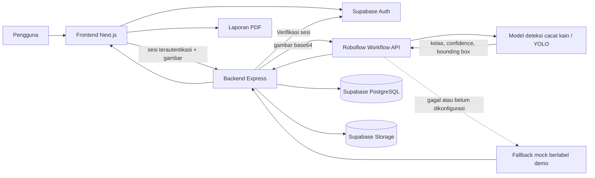
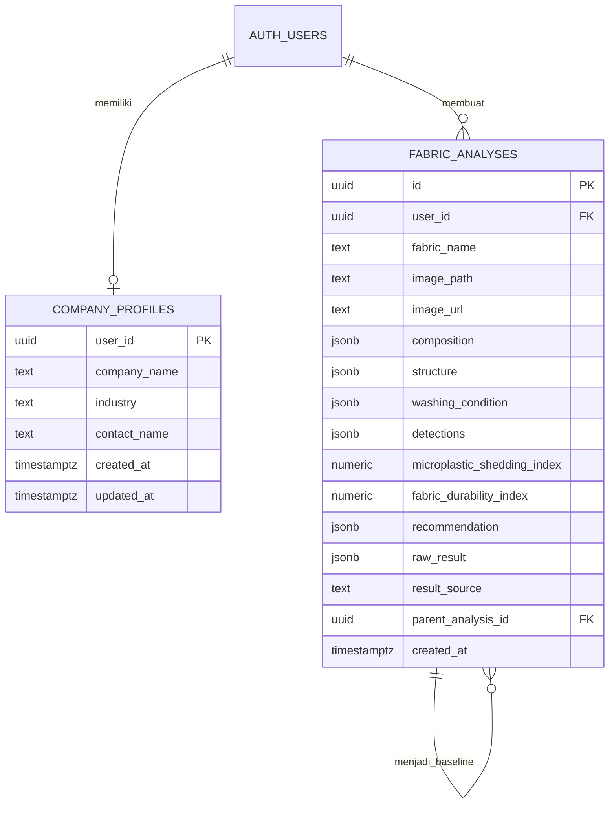

<div align="center">

# FABRIX AI

### Temukan cacat kain sebelum dipotong.

[](https://github.com/raykenzienazaru-dot/PNJ)
[](LICENSE)
[](frontend/package.json)
[](#-status-pengembangan)

**Submission for ITECHNO CUP 2026 — Web Development**

**Tim SATORU**

</div>

---

## 📋 Daftar Isi

- [Tim Pengembang](#-tim-pengembang)
- [Tentang Proyek](#-tentang-proyek)
- [Fitur Unggulan](#-fitur-unggulan)
- [Teknologi](#-teknologi)
- [Arsitektur Sistem](#-arsitektur-sistem)
- [Struktur Database](#-struktur-database)
- [Struktur Folder](#-struktur-folder)
- [Instalasi dan Konfigurasi](#-instalasi-dan-konfigurasi)
- [Panduan Penggunaan](#-panduan-penggunaan)
- [Dokumentasi API](#-dokumentasi-api)
- [Pengujian](#-pengujian)
- [Keamanan](#-keamanan)
- [Status Pengembangan](#-status-pengembangan)
- [Lisensi](#-lisensi)

---

## 👥 Tim Pengembang

| Nama | Peran | GitHub |
| --- | --- | --- |
| **Evelly Khanzania Putri** | Pengembang AI | [Vkzapple](https://github.com/Vkzapple) |
| **Dhiyaa Fazila Nugraha** | Pengembang Full-Stack | [fzlngh](https://github.com/fzlngh) |
| **Raykenzie Nazaru Fathurrahmansyah** | Asisten Riset dan Pengembangan | [raykenzienazaru-dot](https://github.com/raykenzienazaru-dot) |

---

## 🎯 Tentang Proyek

### Latar Belakang

Konveksi dan UMKM tekstil umumnya masih memeriksa kualitas kain secara manual dengan mengandalkan pengamatan mata. Cara ini rawan human error, terutama ketika kain tersedia dalam gulungan panjang dan harus diperiksa dalam jumlah besar.

Masalah yang ingin dibantu oleh FABRIX AI meliputi:

- cacat seperti lubang, noda, sobekan, benang tertarik, dan cacat tenun dapat terlewat saat pemeriksaan visual;
- banyak konveksi dan UMKM tidak memiliki alat khusus atau akses ke laboratorium uji fisik;
- cacat yang baru ditemukan setelah kain dipotong atau dijahit menyebabkan bahan sulit digunakan kembali dan meningkatkan kerugian;
- komplain kepada supplier sulit dilakukan jika tidak disertai gambar, lokasi cacat, dan hasil pemeriksaan yang terdokumentasi dengan jelas.

FABRIX AI dikembangkan sebagai alat bantu pemeriksaan awal dan dokumentasi quality control. Aplikasi ini tidak menggantikan pemeriksaan menyeluruh oleh petugas QC, pengujian laboratorium, sertifikasi, atau keputusan tenaga ahli.

### Solusi yang Ditawarkan

FABRIX AI MVP menyediakan alur pemeriksaan berbasis foto agar cacat dapat ditemukan sebelum kain dipotong atau dijahit:

```text
Periksa bagian kain → Ambil foto → Deteksi cacat → Tinjau area yang ditandai → Simpan bukti → Unduh laporan
```

Foto dari kamera dikirim ke backend dan dianalisis oleh workflow deteksi objek. Hasilnya menandai area yang diduga cacat menggunakan bounding box, kelas cacat, dan confidence. Foto serta hasil pemeriksaan disimpan di Supabase agar dapat ditinjau kembali dan digunakan sebagai dokumentasi awal saat berdiskusi atau mengajukan komplain kepada supplier.

### Tujuan Proyek

- **Tujuan utama:** membantu konveksi dan UMKM menemukan indikasi cacat kain sebelum bahan dipotong atau dijahit.
- **Target pengguna:** pemilik konveksi, pelaku UMKM tekstil, operator quality control, bagian produksi, bagian pembelian, dan penerima bahan dari supplier.
- **Nilai utama:** pemeriksaan berbasis foto yang cepat, penandaan lokasi cacat, riwayat hasil, dan laporan yang dapat menjadi bukti dokumentasi awal.
- **Batas MVP:** pemeriksaan dilakukan pada bagian kain yang difoto; aplikasi belum menggantikan mesin inspeksi gulungan kain secara kontinu.
- **Arah SDG:** mendukung inovasi industri pada SDG 9 serta evaluasi material yang lebih bertanggung jawab dalam konteks SDG 11, tanpa mengklaim pencapaian target SDG secara langsung.

---

## ✨ Fitur Unggulan

### Fitur Utama

| Fitur | Implementasi | Keunggulan |
| --- | --- | --- |
| **Pemindai Kain Berbasis Kamera** | Meminta izin kamera saat halaman scan dibuka, memprioritaskan kamera belakang pada perangkat seluler, serta menyediakan bingkai panduan, ambil ulang, dan penanganan error. | Memudahkan pemeriksaan bagian kain sebelum proses potong dan jahit. |
| **Deteksi Cacat dengan YOLO melalui Roboflow** | Frontend mengirim foto ke backend; adapter server meneruskan gambar sebagai base64 ke Roboflow Workflow untuk mendeteksi indikasi cacat kain. | Membantu mengurangi cacat yang terlewat pada pemeriksaan visual manual. |
| **Visualisasi Area Cacat** | Hasil deteksi berupa kelas, confidence, dan koordinat bounding box digambar di atas gambar kain. | Operator dapat melihat lokasi yang perlu diperiksa ulang secara langsung. |
| **Hasil Analisis Tersimpan** | Gambar disimpan pada Supabase Storage dan hasil disimpan pada tabel `fabric_analyses`. | Hasil dapat dibuka kembali tanpa menjalankan model ulang. |
| **Riwayat Analisis** | Menampilkan analisis milik pengguna yang sedang login, diurutkan dari data terbaru. | Menyediakan jejak pemeriksaan dan bukti visual yang dapat ditinjau kembali. |
| **Perbandingan Kain** | Membandingkan 2–3 hasil tersimpan, termasuk gambar, indeks yang tersedia, dan karakteristik terdeteksi. | Tidak menentukan pemenang otomatis tanpa logika pemeringkatan yang tervalidasi. |
| **Laporan PDF** | Membuat PDF bermerek FABRIX AI dari data analisis yang telah tersimpan. | Dapat digunakan sebagai dokumentasi awal pemeriksaan dan pendukung komunikasi dengan supplier. |

### Fitur Pendukung

- **Autentikasi Supabase:** registrasi, login, persistensi sesi, dan keluar akun.
- **Profil perusahaan:** nama perusahaan, penanggung jawab, industri, dan email akun.
- **Paspor kain:** tampilan identitas dari record analisis yang sama tanpa duplikasi data.
- **Penamaan kain:** hasil baru menggunakan nama awal `Untitled Fabric` dan dapat diubah setelah analisis.
- **What-If Optimizer:** pemilihan analisis dasar sudah berfungsi; parameter skenario menunggu schema input final dari layanan AI.
- **Hasil simulasi yang transparan:** fallback pengembangan selalu diberi label `DEMO RESULT`.
- **Indeks yang transparan:** indeks shedding dan durability dihitung menggunakan heuristik deterministik dari kelas cacat dan confidence; keduanya bukan output langsung model YOLO atau hasil uji laboratorium.
- **Responsif:** antarmuka disiapkan untuk desktop, tablet, dan perangkat seluler.

### Rute Aplikasi

| Route | Fungsi |
| --- | --- |
| `/` | Halaman utama produk |
| `/login` | Login email dan kata sandi melalui Supabase |
| `/register` | Registrasi akun dan perusahaan |
| `/dashboard` | Ringkasan dan analisis terbaru |
| `/scan` | Kamera, pengambilan gambar, dan proses analisis |
| `/analysis/[id]` | Detail hasil, penggantian nama, dan ekspor PDF |
| `/history` | Riwayat analisis pengguna dan aksi PDF |
| `/comparison` | Perbandingan 2–3 hasil analisis |
| `/optimizer` | Pemilihan baseline skenario What-If |
| `/passport` | Pustaka paspor kain |
| `/passport/[id]` | Detail paspor dari analisis tersimpan |
| `/settings` | Pengaturan profil perusahaan |

---

## 🛠 Teknologi

### Tech Stack

#### Frontend

| Teknologi | Versi | Kegunaan |
| --- | --- | --- |
| Next.js | `16.3.4` | App Router, routing, optimasi build, dan penyajian antarmuka |
| React | `18.3.1` | Komponen interaktif dan pengelolaan state antarmuka |
| TypeScript | `5.5.4` | Pemeriksaan tipe data pada frontend |
| Tailwind CSS | `3.4.7` | Sistem desain responsif dan palet visual FABRIX |
| Supabase JS | `2.45.4` | Autentikasi dan pengelolaan sesi di browser |
| jsPDF | `4.2.1` | Pembuatan dan pengunduhan laporan PDF |

#### Backend dan Data

| Teknologi | Versi | Kegunaan |
| --- | --- | --- |
| Node.js | `20.9+` | Runtime backend dan kebutuhan minimum Next.js |
| Express | `5.2.1` | REST API dan orkestrasi layanan |
| Multer | `2.3.0` | Pemrosesan gambar `multipart/form-data` di memori |
| Supabase | Layanan terkelola | Authentication, PostgreSQL, dan Storage |
| Helmet | `7.1.0` | Header keamanan HTTP |
| CORS | `2.8.5` | Pembatasan origin frontend |
| Morgan | `1.10.0` | Log permintaan saat pengembangan |
| node-fetch | `2.7.0` | Komunikasi backend dengan layanan AI |
| Roboflow Workflow | Hosted inference | Menjalankan workflow `fabric-defect-detection_2025-tw6ok-ll8oy` dan mengembalikan prediksi objek |
| Adapter YOLO | Service backend | Mengubah gambar ke base64, memanggil Roboflow, menormalisasi prediksi, dan menyiapkan fallback mock |

### Alasan Pemilihan Teknologi

| Teknologi | Alasan |
| --- | --- |
| **Next.js dan React** | Cocok untuk antarmuka interaktif berbasis route serta mendukung build produksi yang teroptimasi. |
| **TypeScript** | Mengurangi kesalahan bentuk data saat hasil analisis digunakan pada halaman detail, history, comparison, passport, dan PDF. |
| **Tailwind CSS** | Memudahkan konsistensi desain dan responsivitas tanpa menambah pustaka komponen besar. |
| **Express** | Menjadi lapisan terpercaya antara browser, Supabase, dan layanan AI. |
| **Supabase** | Menyediakan autentikasi, database PostgreSQL, dan penyimpanan gambar dalam satu layanan. |
| **YOLO dan Roboflow** | Deteksi cacat dijalankan melalui workflow terkelola sehingga proses inference dan kredensial tetap berada di sisi server. |
| **jsPDF** | Menghasilkan laporan langsung dari data tersimpan tanpa membutuhkan proses AI baru. |

Deployment produksi, CI/CD, monitoring, dan test runner otomatis belum dikonfigurasi pada repository ini.

---

## 🏗 Arsitektur Sistem



### Fungsi YOLO dan Roboflow dalam FABRIX AI

Dalam MVP FABRIX AI, fungsi utama YOLO adalah membantu quality control awal dengan mendeteksi dan menunjukkan lokasi indikasi cacat pada foto kain. Contohnya mencakup lubang, noda, sobekan, pilling, benang tertarik, perubahan warna, atau kelas cacat lain yang dikenali oleh model. Tujuannya bukan menggantikan keputusan operator, tetapi mengarahkan perhatian operator ke area yang perlu diperiksa ulang sebelum kain dipotong atau dijahit.

Model diakses melalui Roboflow Workflow, sedangkan [`backend/services/yoloService.js`](backend/services/yoloService.js) menjadi adapter antara backend FABRIX AI dan layanan tersebut. Repository hanya menyimpan kode integrasi dan ringkasan alur; definisi JSON workflow lengkap, token, dan credential layanan tidak disertakan.

Adapter membaca identitas workspace dan workflow dari environment backend, mengirim input gambar, lalu mengambil output `predictions` tanpa mengekspos konfigurasi privat ke frontend.

Alurnya adalah sebagai berikut:

1. Kamera frontend menghasilkan gambar kain.
2. Backend menerima dan memvalidasi gambar.
3. Adapter mengubah gambar menjadi base64 dan mengirimnya ke endpoint Roboflow Workflow menggunakan `ROBOFLOW_API_KEY`.
4. Respons Roboflow dinormalisasi menjadi daftar deteksi berisi `class`, `class_id`, `confidence`, `x`, `y`, `width`, `height`, dan `detection_id`.
5. Backend menghitung `microplastic_shedding_index` dan `fabric_durability_index` menggunakan bobot heuristik dari kelas cacat dan confidence.
6. Deteksi, indeks, rekomendasi, metadata gambar, identitas workflow, dan respons mentah disimpan pada record analysis.
7. Frontend menggunakan [`frontend/components/DetectionOverlay.tsx`](frontend/components/DetectionOverlay.tsx) untuk menggambar bounding box dan label confidence di atas gambar hasil scan.
8. Jika API key tidak tersedia atau request gagal dan `ALLOW_MOCK_INFERENCE=true`, backend memakai fallback pengembangan dengan `result_source: "mock"`.

Output utama YOLO untuk fungsi quality control adalah kelas cacat, confidence, dan bounding box. `microplastic_shedding_index` serta `fabric_durability_index` bukan output langsung model YOLO; keduanya adalah fitur pendukung eksperimental yang dihitung menggunakan heuristik backend.

Repository ini tidak menyertakan server Python atau bobot model YOLO karena inference dijalankan oleh Roboflow. Hasil dengan `result_source: "ai_service"` berasal dari workflow Roboflow, sedangkan hasil dengan `result_source: "mock"` hanya data demonstrasi. Semua indikasi cacat perlu dikonfirmasi kembali oleh operator QC.

Referensi integrasi tersedia pada [dokumentasi deployment Roboflow Workflow](https://docs.roboflow.com/workflows/deploy-a-workflow).

### Alur Scan

1. Browser meminta izin kamera melalui `navigator.mediaDevices.getUserMedia()`.
2. Frame video digambar ke canvas dan diubah menjadi berkas JPEG.
3. Frontend mengirim gambar melalui sesi pengguna yang sudah terautentikasi ke `POST /api/scan`.
4. Backend memverifikasi token melalui Supabase Auth.
5. Backend menyimpan gambar ke bucket `fabric-images` menggunakan path `user_id/nama-file`.
6. Backend memanggil Roboflow Workflow melalui adapter YOLO.
7. Hasil deteksi, indeks heuristik, metadata gambar, dan sumber hasil disimpan pada `fabric_analyses`.
8. Frontend membuka `/analysis/[id]` dan menggambar bounding box pada gambar yang tersimpan.

Frontend tidak memuat model AI dan tidak memiliki service-role key.

---

## 🗃 Struktur Database



Row Level Security aktif pada `company_profiles` dan `fabric_analyses`. Schema lengkap tersedia pada [`supabase/schema.sql`](supabase/schema.sql).

---

## 📁 Struktur Folder

```text
PNJ/
├── backend/
│   ├── middleware/
│   │   └── authMiddleware.js
│   ├── routes/
│   │   ├── auth.js
│   │   └── scan.js
│   ├── services/
│   │   ├── supabaseClient.js
│   │   └── yoloService.js
│   ├── package.json
│   └── server.js
├── frontend/
│   ├── app/
│   │   ├── analysis/[id]/
│   │   ├── comparison/
│   │   ├── dashboard/
│   │   ├── history/
│   │   ├── login/
│   │   ├── optimizer/
│   │   ├── passport/[id]/
│   │   ├── register/
│   │   ├── scan/
│   │   └── settings/
│   ├── components/
│   │   └── DetectionOverlay.tsx
│   ├── lib/
│   ├── types/
│   └── package.json
├── supabase/
│   └── schema.sql
├── LICENSE
└── README.MD
```

---

## ⚙ Instalasi dan Konfigurasi

### Prasyarat

- Git
- Node.js `20.9` atau lebih baru
- npm
- Proyek Supabase
- Browser dengan dukungan kamera
- Akun Roboflow dan private API key jika ingin menggunakan inference asli

> Kamera browser dapat digunakan melalui `localhost` saat pengembangan. Deployment produksi harus menggunakan HTTPS.

### 1. Clone Repository

```bash
git clone https://github.com/raykenzienazaru-dot/PNJ.git
cd PNJ
```

### 2. Siapkan Supabase

1. Buka **Supabase Dashboard → SQL Editor**.
2. Jalankan isi [`supabase/schema.sql`](supabase/schema.sql).
3. Pastikan tabel `company_profiles`, tabel `fabric_analyses`, dan bucket `fabric-images` tersedia.

SQL tersebut juga menambahkan RLS, trigger `updated_at`, serta trigger pembuatan profil setelah user terdaftar.

### 3. Siapkan Environment Frontend

Konfigurasikan variabel berikut melalui environment lokal atau secret manager pada platform deployment. Jangan menuliskan nilai asli ke README atau commit Git.

| Variabel | Keterangan |
| --- | --- |
| `NEXT_PUBLIC_SUPABASE_URL` | URL proyek Supabase yang digunakan frontend |
| `NEXT_PUBLIC_SUPABASE_ANON_KEY` | Public anon key Supabase; jangan menggantinya dengan service-role key |
| `NEXT_PUBLIC_API_URL` | Alamat backend FABRIX AI |

### 4. Siapkan Environment Backend

Konfigurasikan variabel backend berikut hanya melalui environment lokal atau secret manager. Nilai asli tidak boleh ditempatkan pada frontend, README, source code, atau commit Git.

| Variabel | Keterangan |
| --- | --- |
| `PORT` | Port server backend |
| `FRONTEND_ORIGIN` | Origin frontend yang diizinkan oleh CORS |
| `SUPABASE_URL` | URL proyek Supabase |
| `SUPABASE_SERVICE_ROLE_KEY` | Credential privat Supabase khusus backend |
| `ROBOFLOW_API_BASE` | Base URL layanan inference Roboflow |
| `ROBOFLOW_API_KEY` | Private API key Roboflow khusus backend |
| `ROBOFLOW_WORKSPACE` | Identitas workspace pemilik workflow |
| `ROBOFLOW_WORKFLOW_ID` | Identitas workflow deteksi cacat |
| `ALLOW_MOCK_INFERENCE` | Mengaktifkan atau menonaktifkan fallback data demo |

Backend memverifikasi sesi melalui `supabase.auth.getUser()`. Pada production, nonaktifkan fallback mock jika kegagalan layanan harus menghasilkan error dan simpan semua credential privat menggunakan secret manager platform deployment.

### 5. Instal Dependency

```powershell
cd backend
npm ci

cd ../frontend
npm ci
```

### 6. Jalankan Mode Development

Terminal backend:

```powershell
cd backend
npm run dev
```

Terminal frontend:

```powershell
cd frontend
npm run dev
```

Buka aplikasi melalui [http://localhost:3000](http://localhost:3000). Status backend dapat diperiksa melalui [http://localhost:4000/health](http://localhost:4000/health).

---

## 🚀 Panduan Penggunaan

### Alur Pengguna

1. Buka halaman utama dan pilih **Mulai Sekarang**.
2. Daftarkan akun perusahaan atau login dengan akun yang sudah ada.
3. Dari dashboard, pilih **Scan Fabric**.
4. Izinkan akses kamera pada browser.
5. Posisikan kain dekat kamera dengan cahaya cukup dan tanpa bayangan kuat.
6. Tekan **Capture Fabric**, lalu tinjau hasil tangkapan.
7. Pilih **Retake** jika gambar kurang jelas atau **Analyze Fabric** untuk melanjutkan.
8. Tunggu proses analisis selesai hingga halaman hasil terbuka.
9. Ubah nama kain bila diperlukan, kemudian pilih **Save Analysis**.
10. Gunakan **Download PDF**, **Compare**, atau **Explore What-If** sesuai kebutuhan.

### Hasil Analisis

Halaman hasil menampilkan field yang tersedia pada record analisis:

- `detections`, termasuk kelas, confidence, dan bounding box;
- `microplastic_shedding_index`
- `fabric_durability_index`
- `composition`
- `structure`
- `washing_condition`
- `recommendation`

Frontend tidak mengarang nilai yang kosong. Bounding box digambar dari koordinat Roboflow dan dimensi asli pada `raw_result.image_meta`. Indeks shedding dan durability dibentuk di backend menggunakan heuristik atas hasil deteksi. Jika `result_source` bernilai `mock`, antarmuka dan PDF menampilkan label **DEMO RESULT**.

### Laporan PDF

PDF dibuat dari data yang sudah tersimpan pada Supabase. Pembuatan laporan:

- tidak menjalankan inference ulang;
- tidak mengubah atau menghapus analysis;
- menyembunyikan bagian yang tidak memiliki data;
- menggunakan nama berkas `FABRIX_AI_[NamaKain]_[AnalysisID].pdf`;
- dapat dijalankan dari halaman hasil, history, dan passport.

---

## 📚 Dokumentasi API

### Base URL

```text
Development: http://localhost:4000
Production:  belum dikonfigurasi
```

Semua endpoint `/api/*` hanya dapat diakses oleh pengguna yang memiliki sesi Supabase valid. Frontend aplikasi menangani pengiriman sesi secara otomatis; README tidak menyertakan token atau contoh header autentikasi.

Endpoint `/health` tidak memerlukan autentikasi.

### Endpoint

| Method | Endpoint | Autentikasi | Fungsi |
| --- | --- | --- | --- |
| `GET` | `/health` | Tidak | Memeriksa status backend |
| `GET` | `/api/auth/me` | Ya | Mengambil user dan profil perusahaan |
| `POST` | `/api/auth/company-profile` | Ya | Membuat atau memperbarui profil perusahaan |
| `POST` | `/api/scan` | Ya | Menyimpan gambar, menjalankan inference, dan menyimpan hasil |
| `GET` | `/api/scan/history` | Ya | Mengambil seluruh analysis milik user, terbaru lebih dulu |
| `GET` | `/api/scan/:id` | Ya | Mengambil satu analysis milik user |
| `PATCH` | `/api/scan/:id` | Ya | Mengubah nama kain pada analysis tersimpan |
| `POST` | `/api/scan/compare` | Ya | Mengambil 2–3 analysis milik user untuk dibandingkan |
| `POST` | `/api/scan/:id/whatif` | Ya | Menjalankan ulang gambar tersimpan dengan data skenario |

### Contoh Permintaan Scan

`POST /api/scan` menggunakan `multipart/form-data`.

| Field | Tipe | Wajib | Keterangan |
| --- | --- | --- | --- |
| `image` | File | Ya | JPEG, PNG, atau WebP; maksimum 8 MB |
| `fabric_name` | String | Tidak | Nilai awal `Untitled Fabric` jika kosong |
| `composition` | JSON/String | Tidak | Data komposisi jika tersedia |
| `structure` | JSON/String | Tidak | Data struktur jika tersedia |
| `washing_condition` | JSON/String | Tidak | Kondisi pencucian jika tersedia |

Contoh response ringkas:

```json
{
  "analysis": {
    "id": "uuid-analysis",
    "fabric_name": "Kain Contoh",
    "image_path": "user-id/nama-file.jpg",
    "result_source": "ai_service",
    "detections": [
      {
        "class": "hole",
        "confidence": 0.91,
        "x": 320,
        "y": 240,
        "width": 84,
        "height": 67
      }
    ],
    "microplastic_shedding_index": 0.2,
    "fabric_durability_index": 0.83,
    "created_at": "2026-09-03T00:00:00.000Z"
  }
}
```

Nilai pada contoh hanya menunjukkan bentuk data. Kelas, confidence, koordinat, dan indeks aktual bergantung pada hasil workflow dan perhitungan backend.

---

## 🧪 Pengujian

### Frontend

```powershell
cd frontend
npm run lint
npm run typecheck
npm run build
npm audit --audit-level=moderate
```

### Backend

```powershell
cd backend
node --check server.js
node --check routes/auth.js
node --check routes/scan.js
node --check services/yoloService.js
npm audit --audit-level=moderate
```

### Hasil Verifikasi Terakhir

| Pemeriksaan | Hasil |
| --- | --- |
| ESLint frontend | Lulus |
| TypeScript frontend | Lulus |
| Build produksi Next.js | Lulus |
| Audit dependency frontend | 0 kerentanan |
| Audit dependency backend | 0 kerentanan |
| HTTP seluruh route utama | `200 OK` |
| Endpoint terlindungi tanpa token | `401 Unauthorized` |
| Koneksi tabel dan bucket Supabase | Berhasil |
| Smoke test auth → profile → scan → detail → rename → history → comparison | Berhasil |
| Pembersihan akun, record, dan gambar smoke test | Berhasil |
| Koneksi nyata Roboflow Workflow dengan API key lokal | Berhasil; `result_source: "ai_service"` |
| Normalisasi prediksi dan metadata gambar Roboflow | Berhasil |

Repository belum memiliki unit test suite, end-to-end test suite permanen, atau angka test coverage. Tabel di atas mencatat verifikasi manual dan build yang benar-benar telah dijalankan, bukan coverage otomatis.

---

## 🔐 Keamanan

- Frontend hanya menggunakan Supabase anon key.
- Service-role key hanya boleh berada pada `backend/.env` dan tidak boleh dikirim ke browser atau Git.
- Backend memverifikasi access token melalui Supabase Auth sebelum memproses endpoint aplikasi.
- Query analysis selalu difilter menggunakan `user_id` milik sesi terverifikasi.
- RLS tetap diaktifkan sebagai lapisan perlindungan database.
- Tipe gambar dibatasi pada JPEG, PNG, dan WebP dengan ukuran maksimum 8 MB.
- Semua file environment lokal diabaikan oleh Git; nilai credential harus disimpan melalui konfigurasi lokal atau secret manager dan tidak boleh dicantumkan dalam dokumentasi.
- Bucket `fabric-images` masih public untuk prototipe lomba. Production sebaiknya menggunakan private bucket dan signed URL karena gambar kain perusahaan dapat bersifat sensitif.

---

## 🚧 Status Pengembangan

### Sudah Tersedia

- Autentikasi Supabase dan profil perusahaan
- Dashboard dan navigasi responsif
- Kamera realtime, capture, retake, dan error state
- Upload gambar hasil kamera ke Supabase Storage
- Penyimpanan dan pembacaan `fabric_analyses`
- Halaman detail analysis
- History, comparison 2–3 kain, dan passport
- Penamaan ulang analysis
- PDF export dari data tersimpan
- Adapter backend YOLO melalui Roboflow Workflow
- Penyimpanan kelas, confidence, koordinat bounding box, dan metadata gambar
- Overlay lokasi cacat pada halaman detail analysis dan passport
- Perhitungan indeks heuristik berdasarkan hasil deteksi
- Fallback mock yang diberi label demo
- Konfigurasi lokal frontend dan backend

### Belum Tersedia atau Belum Final

- Schema input final untuk What-If Optimizer
- Bobot model dan server inference lokal tidak disertakan karena workflow berjalan di Roboflow
- Validasi ilmiah untuk heuristik shedding dan durability
- URL deployment production
- CI/CD dan monitoring production
- Test suite otomatis serta laporan coverage
- Bucket gambar private dengan signed URL

Jika Roboflow belum dikonfigurasi atau tidak dapat dihubungi dan `ALLOW_MOCK_INFERENCE=true`, backend menggunakan fallback development. Hasil mock wajib diperlakukan sebagai data demo. Hasil Roboflow dan indeks heuristik tetap merupakan alat bantu pemeriksaan awal, bukan hasil pengujian laboratorium atau sertifikasi.

---

## 📄 Lisensi

Proyek ini menggunakan [MIT License](LICENSE). Lihat file `LICENSE` untuk ketentuan lengkap.

---

<div align="center">

**Dibuat oleh Tim SATORU untuk ITECHNO CUP 2026**

**FABRIX AI — Prediksi. Bandingkan. Optimalkan.**

</div>
